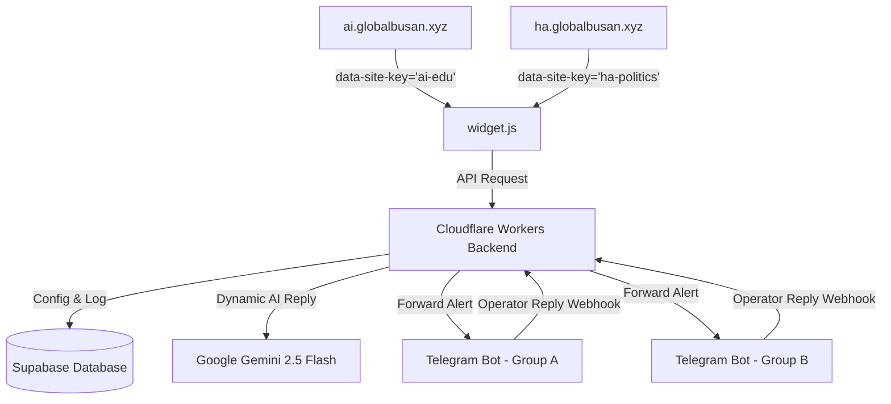

# Product Requirements Document (PRD)
## 🌌 Multi-Tenant Domain-Specific AI Chatbot System (Agentumi Engine)

### 1. 개요 (Executive Summary)
본 프로젝트는 여러 독립적인 웹사이트(도메인)에서 각 도메인 특성에 맞는 맞춤형 AI 챗봇을 유연하게 배포 및 관리할 수 있도록 설계된 **멀티테넌트(Multi-Tenant) 챗봇 엔진**입니다. 단일 분산 백엔드(Cloudflare Workers)와 데이터베이스(Supabase)를 공유하면서도, 도메인별로 완전히 독립된 프롬프트, 웰컴 메시지, 디자인 테마, 그리고 각각 다른 운영자용 텔레그램 채널을 연동하여 중앙 통제식으로 서비스할 수 있는 아키텍처를 제공합니다.

---

### 2. 핵심 목표 및 가치 (Core Goals & Value Proposition)
1. **완전한 독립성 (Domain Isolation)**:
   * 도메인마다 서로 다른 AI 성격(System Prompt), 웰컴 안내문, 퀵 버튼 질문 세트 설정.
   * 각 도메인 전용의 텔레그램 봇 토큰 및 수신 대상 Chat ID 매핑 지원.
2. **초간단 임베딩 (Plug & Play Script)**:
   * 한 줄의 `<script>` 태그를 삽입하는 것만으로 해당 사이트에 즉시 고성능 챗봇 구동.
   * `data-site-key` 속성을 감지하여 백엔드에서 테마 정보와 AI 설정값을 동적으로 조립 및 주입.
3. **확장성 및 고성능 (Scalability & Performance)**:
   * Cloudflare Workers와 Hono 프레임워크를 기반으로 전 세계 어디서나 10ms 내외의 응답 보장.
   * Supabase를 활용해 데이터 정합성과 실시간 채팅 로깅 완벽 처리.

---

### 3. 시스템 아키텍처 (System Architecture)

---

### 4. 데이터베이스 스키마 설계 (Database Schema)

#### 4.1 `chatbot_configs` (도메인별 설정 테이블)
| 컬럼명 | 데이터 타입 | 설명 |
| :--- | :--- | :--- |
| `id` | SERIAL (PK) | 고유 식별자 |
| `site_key` | VARCHAR(100) (UQ, NN) | 도메인을 구별하는 고유 키 (예: `ai-edu`, `ha-politics`) |
| `site_domain` | VARCHAR(255) (NN) | 실제 서비스 주 도메인 주소 |
| `bot_title` | VARCHAR(100) (NN) | 챗봇 헤더 타이틀 |
| `welcome_message` | TEXT (NN) | 첫 접속 시 출력할 환영 인사 및 안내 가이드 (HTML 지원) |
| `system_prompt` | TEXT (NN) | Gemini AI 전용 맞춤형 프롬프트 지침 |
| `quick_questions` | TEXT[] | 빠른 선택 버튼 질문 리스트 |
| `telegram_bot_token`| VARCHAR(255) | 해당 도메인 알림용 전용 텔레그램 봇 토큰 |
| `telegram_chat_id` | VARCHAR(100) | 해당 도메인 알림용 전용 텔레그램 수신 Chat ID |
| `theme_color` | VARCHAR(20) | 챗봇 UI 메인 테마 색상 (예: `#00b894`) |
| `created_at` | TIMESTAMP | 생성 시간 |
| `updated_at` | TIMESTAMP | 수정 시간 |

#### 4.2 `chatbot_sessions` (대화 세션 테이블)
| 컬럼명 | 데이터 타입 | 설명 |
| :--- | :--- | :--- |
| `id` | VARCHAR(100) (PK) | 브라우저 세션 ID (`session_...`) |
| `site_key` | VARCHAR(100) (FK) | `chatbot_configs.site_key` 참조 |
| `telegram_message_id`| BIGINT | 마지막으로 전송된 텔레그램 알림 메시지 ID (답장 매핑용) |
| `created_at` | TIMESTAMP | 세션 생성 시간 |

#### 4.3 `chatbot_messages` (대화 내역 테이블)
| 컬럼명 | 데이터 타입 | 설명 |
| :--- | :--- | :--- |
| `id` | SERIAL (PK) | 고유 메시지 ID |
| `session_id` | VARCHAR(100) (FK) | `chatbot_sessions.id` 참조 및 연동 |
| `sender` | VARCHAR(20) (NN) | 발신자 구분 (`user`, `bot`, `admin`) |
| `message` | TEXT (NN) | 대화 메시지 본문 |
| `created_at` | TIMESTAMP | 메시지 발신 시간 |

---

### 5. 상세 기능 및 유즈케이스 (Feature Specifications)

#### 5.1 Dynamic Custom Widget
* 클라이언트 페이지에 임베딩된 `widget.js`는 `<script data-site-key="ai-edu">` 형태로 로드됩니다.
* 백엔드의 `GET /api/telegram/widget.js`는 `site-key`에 따른 스타일시트(`theme_color`), 타이틀(`bot_title`), 퀵 버튼들(`quick_questions`)을 데이터베이스로부터 읽어들여 하나의 스크립트로 **동적 빌드하여 클라이언트에 주입**합니다.
* 사용자가 창을 열면, 말풍선 아이콘이 **부드러운 회전 모션과 함께 X 아이콘으로 즉시 전환**됩니다.

#### 5.2 Multi-Agent AI Response
* 사용자가 질문을 전송하면 백엔드 `/api/telegram/send`는 `site_key`에 할당된 맞춤형 `system_prompt`를 로드하여 Gemini API에 주입하고 상황에 완벽히 맞는 전문 답변을 즉시 실시간 렌더링합니다.

#### 5.3 Dedicated Webhook Router
* 운영자가 텔레그램 알림 메시지에 **"답장(Reply)"**을 쓰면 텔레그램 웹훅 라우터가 알림을 보냈던 봇 토큰과 대조하여 어떤 도메인 세션의 메시지인지 파악한 뒤, 정확히 해당 세션에 `admin` 메시지로 삽입합니다.
* 클라이언트 위젯은 4초마다 백엔드의 `/api/telegram/messages`를 읽어가며 실시간으로 운영자의 답장을 말풍선에 추가합니다.

---

### 6. 비기능 요건 (Non-Functional Requirements)
1. **보안 (Security)**:
   * RLS(Row Level Security)를 활성화하여 익명 클라이언트는 지정된 select/insert API 외에 데이터베이스 구조나 Secrets를 직접 볼 수 없도록 차단합니다.
   * 백엔드는 민감한 DB Key나 API Key를 Cloudflare Secrets 환경 변수로 철저히 관리합니다.
2. **CORS 대응 (CORS Policy)**:
   * 백엔드는 동적 origin 판별 로직을 거쳐, `chatbot_configs`에 등록된 `site_domain`과 일치하거나 그 서브도메인일 경우에 한해 완벽히 CORS 요청을 통과시킵니다.
3. **장애 격리 (Fault Isolation)**:
   * 특정 도메인의 텔레그램 설정 오류나 데이터베이스 오류가 다른 도메인의 챗봇 구동에 영향을 미치지 않도록 철저한 에러 핸들링과 격리 처리를 구현합니다.
